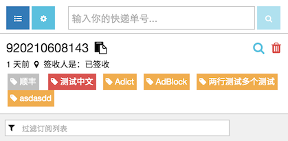
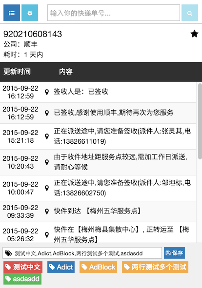
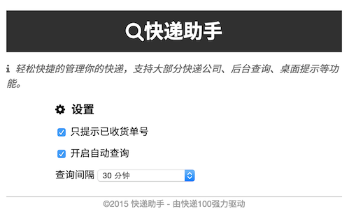

#Welcome!!!

## 說明

>想要一個有快遞提醒功能的工具，自動識別，可以訂閱，並且定時更新後發出通知。

>Building my first Chrome extension to learn AngularJS.

## 安装

## 功能
+ 輸入快遞單號直接查詢。
+ 支持國內外多種快遞。
+ 標籤功能。
+ 訂閱。
+ 桌面提示。

## 界面

訂閱管理移到彈出窗口，並重新設計

- 分享按鈕可以複製單號和快遞類型到剪貼板
- 查詢按鈕可以重新查詢當前單號
- 刪除則是從訂閱列表中刪除

新的結果頁面，整合標記功能

- 訂閱按鈕，訂閱或者取消
- 標籤使用半角的逗號`,`分開

簡單的設置頁面

## 更新和錯誤

+ 多接口查詢
+ 瀏覽器同步
+ 優化列表

## 链接
- *[generator-chrome-extension](https://github.com/yeoman/generator-chrome-extension)*
-  *[kuaidi100](http://www.kuaidi100.com/)*
