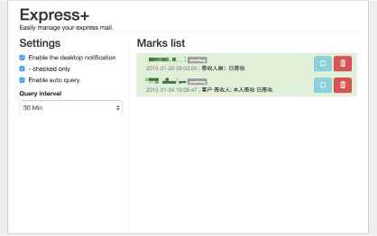

#Welcome!!!

>想要一個有快遞提醒功能的工具，自動識別，可以訂閱，並且定時更新後發出通知。

>Building my first Chrome extension to learn AngularJS.

##Install
[Chrome Web Store](https://chrome.google.com/webstore/detail/express+/hghlokkgbicmblinhepcibacaiegldeg)

##UI
+ popup界面，直接輸入快遞單號直接查詢。
+ 输入框下会出现识别出的类型
+ 獲取結果會顯示出類型、時間和更新列表。
+ 右上角可訂閱，會在定時在後臺更新，如果發現新信息的話會彈出桌面窗口提示。

 

+ options界面，設置提醒信息。(查詢間隔等)
+ 訂閱列表管理

##Roadmap

+ 多接口查詢

##Links
-  *[kuaidi100](http://www.kuaidi100.com/)*
